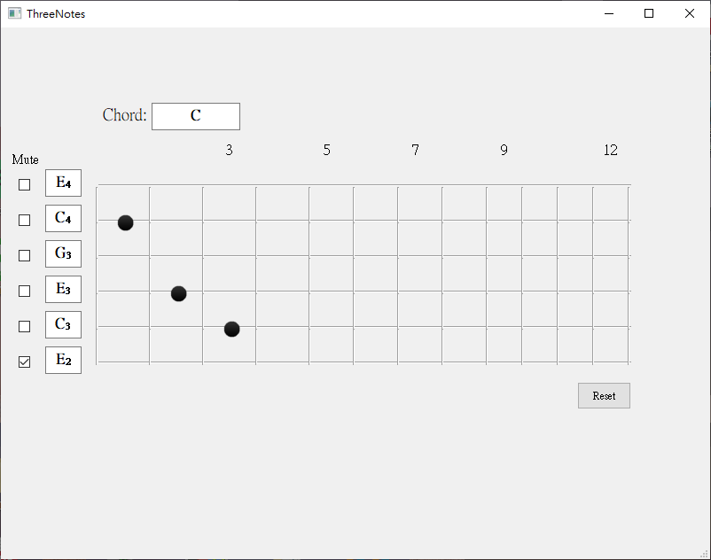

# ThreeNotes
A fretboard playground for guitar.

Show the component notes and chord now playing.

## Operations Support
1. [Click] on strings (each string with 12 frets).
1. [Mute] the strings.
1. [Reset] to the initial state.

## Software screenshot:

## Attention
1. When identifying chord, non-root open strings must be muted!!!.
    For example:
    * Chord C needs to mute 6-th string.
    * Chord D needs to mute 5-th and 6-th strings.

## Future Works
1. Show the component notes of specific chord.
1. Show the all the press points of specific note.
1. Show the possible fingering patterns of specific chord.
